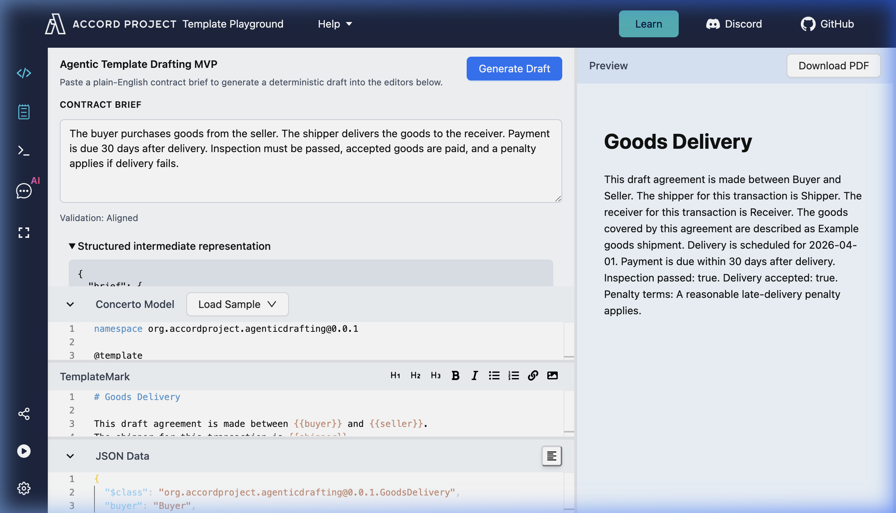
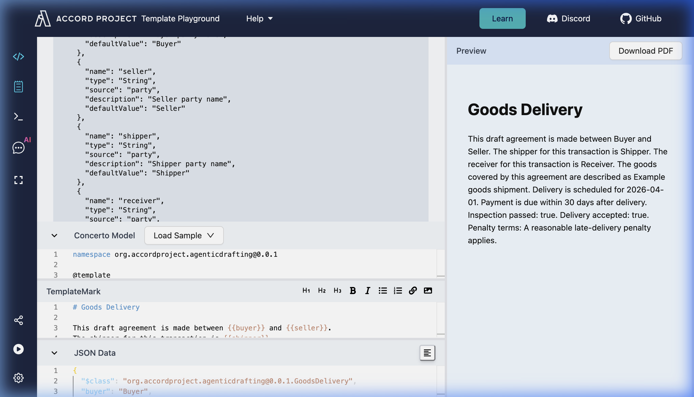

# Accord Drafting Layer

A Deterministic, Logic-Aware Drafting Layer for the Accord Project Ecosystem

---

## Overview

This project introduces a drafting layer that bridges the gap between natural language intent and executable smart contracts.

**Natural Language Contract Intent** → **Executable Accord Templates**


It enables users to input a plain-English contract brief and automatically generate:

* **TemplateMark** (`grammar.tem.md`)
* **Concerto model** (`model.cto`)
* **Structured Intermediate Representation (IR)** with logic-aware extraction
* **Validation report** (structural + logic consistency)

---

## Repository Contents

This repository contains:

* **`core/drafting/`**: The standalone, logic-aware drafting pipeline.
* **`template-playground/`**: An integrated copy of the Accord Template Playground with the drafting panel wired in.
* **`assets/`**: Documentation screenshots.

---

## Quick Navigation

| Component | Path |
| :--- | :--- |
| **Type Definitions (IR)** | `core/drafting/types.ts` |
| **Extractor** | `core/drafting/extractor.ts` |
| **Generator** | `core/drafting/generator.ts` |
| **Validator** | `core/drafting/validator.ts` |
| **Pipeline Entry Point** | `core/drafting/index.ts` |
| **UI Integration** | `template-playground/src/components/DraftingPanel.tsx` |
| **State Management** | `template-playground/src/store/store.ts` |

---

## The Problem

The Accord ecosystem provides powerful tools for contract execution, but lacks a bridge for natural language entry.

* **High learning curve**: New users struggle with TemplateMark and Concerto syntax.
* **Manual drafting**: Converting intent to models is slow and error-prone.
* **No logic reasoning**: Existing tools do not extract contract logic (obligations, conditions, deadlines).

---

## The Solution

A deterministic drafting pipeline that understands **contract logic**, not just keywords:

1. **Extracts** parties, obligations, conditions, and temporal constraints from natural language.
2. **Generates** obligation-driven TemplateMark clauses and a matching Concerto model.
3. **Validates** structural and logic consistency between template and model.
4. **Applies** results directly into the Playground editors atomically.

---

## High-Level Architecture

1. **Natural Language Brief** (Input)
2. **Extractor** → Structured IR (parties, obligations, conditions, temporal)
3. **Generator** → TemplateMark + Concerto model
4. **Validator** → Structural + logic alignment report
5. **Template Playground** → Live IDE preview
6. **Template Engine** → Contract execution

---

## Structured Intermediate Representation (IR)

The core innovation of this project is the **logic-aware IR** that sits between natural language and generated code.

```typescript
interface ExtractedContract {
  brief: string;
  parties: string[];              // buyer, seller, shipper, receiver
  concepts: string[];             // goods, delivery, payment, penalty
  obligations: Obligation[];      // actor → action → target
  conditions: ConditionClause[];  // if / unless / when / in_case
  temporalConstraints: TemporalConstraint[]; // within / after / before / deadline
  fields: DraftField[];           // schema-ready typed fields
}
```

### Example Extraction

**Input:**
> Buyer agrees to pay seller within 10 days after delivery. Unless inspection is passed, no payment shall be made.

**Extracted IR:**

| Component | Extracted Value |
| :--- | :--- |
| **Obligation** | `buyer → pay → seller` |
| **Condition** | `[unless] inspection is passed` |
| **Temporal** | `within 10 days after delivery` |

**Generated Template:**
```
Unless {{conditionExpression}}, the terms below shall apply.
The {{buyer}} shall pay {{seller}} within {{timeAmount}} {{timeUnit}} after {{referenceEvent}}.
```

**Generated Model:**
```
concept DeliveryPayment {
  o String buyer
  o String seller
  o Integer timeAmount
  o String timeUnit
  o String referenceEvent
  o String conditionExpression optional
  o Boolean inspectionPassed
}
```

---

## Intermediate Representation (IR) Deep Dive

One of the project's key innovations is the **Structured Intermediate Representation**. Before generating code, the pipeline extracts a rich JSON object from the contract brief. This ensures that the generated TemplateMark and Concerto models are perfectly aligned with the user's intent.

### How it works:
1. **Extraction**: Rule-based heuristics identify parties, time conditions, and contract-specific nouns.
2. **Normalized Text**: The brief is cleaned and normalized for consistent processing.
3. **Variable Mapping**: Concepts are mapped to typed fields (e.g., `String`, `Integer`, `Boolean`).

#### Visual Breakdown of the IR:

| Part | Description | Visual |
| :--- | :--- | :--- |
| **Top: Brief & Parties** | Original text and identified legal entities. |  |
| **Middle: Concepts & Nouns** | Extracted commercial nouns and timing conditions. |  |
| **Bottom: Typed Fields** | Final schema-ready fields with default values. |  |

---

## Core Modules

### 1. Extractor (`extractor.ts`)
* Detects **Parties**: buyer, seller, shipper, receiver, and aliases.
* Detects **Obligations**: `agrees to`, `shall`, `must`, `is required to`, `will` patterns.
* Detects **Conditions**: `if`, `unless`, `when`, `in case of`, `provided that`.
* Detects **Temporal constraints**: `within N days`, `due in N days`, `after delivery`, `before deadline`.

### 2. Generator (`generator.ts`)
* Builds **obligation-driven clauses**: `The {{buyer}} shall pay {{seller}} within {{timeAmount}} {{timeUnit}} after {{referenceEvent}}.`
* Builds **conditional blocks**: `Unless {{conditionExpression}}, the terms below shall apply.`
* Produces matching **Concerto models** with `optional` fields for conditional logic.

### 3. Validator (`validator.ts`)
* **Variable consistency**: every `{{variable}}` in the template must exist in the model.
* **Temporal logic**: if temporal constraints were extracted, model must have `timeAmount`, `timeUnit`, or `referenceEvent`.
* **Condition logic**: if conditions were extracted, `conditionExpression` must be in both model and template.
* **Obligation alignment**: obligation actors must correspond to model fields.
* **Unused field warnings**: any model field not referenced in the template is flagged.

---

## Running the Pipeline

```bash
# Run the smoke test
cd accord-drafting-layer
npx vite-node smoke-test.ts
```

## Running the Playground

```bash
cd template-playground
npm install
npm run dev
```

---

## Design Principles

* **Deterministic Pipeline**: Reproducible and testable without external LLM dependencies.
* **Logic over Keywords**: The IR captures obligations and conditions, not just noun lists.
* **Extensible Strategy**: Implement `DraftingStrategy` to plug in LLM-based extraction.
* **Minimal Integration**: Reuses existing Playground components without UI redesign.

---

## Future Work

* **LLM Orchestration**: Swap rule-based extractor with an LLM-based one via `DraftingStrategy`.
* **Clause Libraries**: Match extracted concepts to known clause templates.
* **Multi-agent Workflows**: Collaborative drafting, review, and negotiation agents.
* **Monetary Extraction**: Parse amounts (e.g., `$500/day`) into typed fields.

---

## Note

This repository includes a snapshot of Template Playground to demonstrate the integration of the drafting layer. The original repository remains the source of truth for the core playground.

---

## Conclusion

This project delivers a logic-aware drafting pipeline that establishes a clear path from human intent to executable smart contracts — going beyond keyword extraction to model the actual legal logic of a contract.
