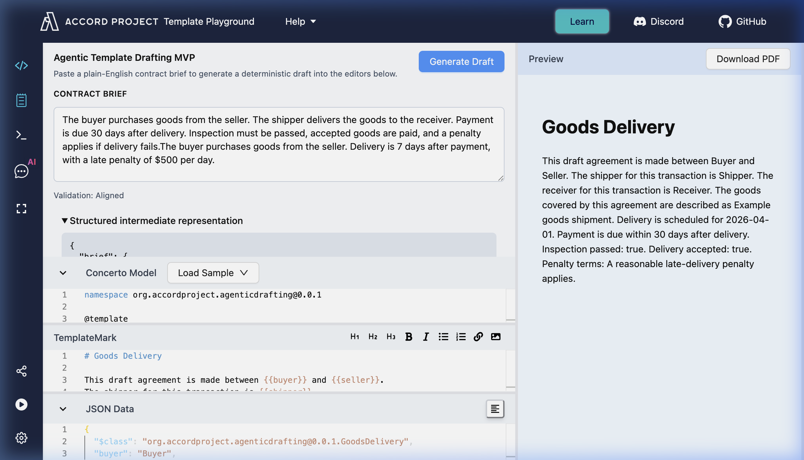

# Accord Drafting Layer

A Deterministic Drafting Layer for the Accord Project Ecosystem

---

## Overview

This project introduces a drafting layer that bridges the gap between natural language intent and executable smart contracts.

**Natural Language Contract Intent** → **Executable Accord Templates**



It enables users to input a plain-English contract brief and automatically generate:

* **TemplateMark** (`grammar.tem.md`)
* **Concerto model** (`model.cto`)
* **Structured contract representation** (JSON)
* **Validation report** (Structural alignment)

The system is implemented inside a working copy of the **Template Playground** to ensure real usability and integration.

---

## Repository Contents

This repository contains:

* **Integrated Template Playground**: A copy of the playground featuring the new drafting surface.
* **Deterministic Drafting Pipeline**: Modular logic located in `src/drafting/`.
* **UI Integration**: Real-time drafting panel and atomic state updates.

---

## Quick Navigation

To review the core contributions, focus on these key areas:

| Component | Path |
| :--- | :--- |
| **Drafting Pipeline** | `template-playground/src/drafting/` |
| **UI Integration** | `template-playground/src/components/DraftingPanel.tsx` |
| **State Management** | `template-playground/src/store/store.ts` |
| **Page Layout** | `template-playground/src/pages/MainContainer.tsx` |

---

## The Problem

The Accord ecosystem provides powerful tools for contract execution, but lacks a bridge for natural language entry.

* **High learning curve**: New users struggle with TemplateMark and Concerto syntax.
* **Manual drafting**: Converting intent to models is slow and error-prone.
* **Fragmented workflow**: No single place to go from "Idea" to "Executable Code".

---

## The Solution

This system introduces a deterministic drafting pipeline that:

1. **Extracts** entities and conditions from natural language using rule-based heuristics.
2. **Generates** both the text and the model simultaneously to ensure alignment.
3. **Validates** the relationship between placeholders and schema fields.
4. **Applies** the results directly into the interactive Playground editors.

---

## High-Level Architecture

1. **Natural Language Brief** (Input)
2. **Extractor** (Structured Intent)
3. **Generator** (Mark + Model)
4. **Validator** (Alignment Check)
5. **Template Playground** (IDE + Preview)
6. **Template Engine** (Execution)

---

## Position in the Accord Ecosystem

* **Upstream**: Natural Language Input (Users, Agentic Systems)
* **This Project**: **Drafting Layer** (Intent to Schema)
* **Downstream**: Template Playground → Template Engine → Contract Execution

---

## Core Modules

### 1. Extractor
* Rule-based parsing for high reliability.
* Detects **Parties** (buyer, seller, etc.), **Time conditions** (days, deadlines), and **Contract concepts** (payment, delivery).

### 2. Generator
* Produces **TemplateMark** (grammar format) and **Concerto** models.
* Generates sample **JSON Data** matching the new model.

### 3. Validator
* Static analysis of the generated output.
* Ensures all template variables have matching model fields.
* Flags unused model fields or missing text placeholders.

---

## Example

**Input:**
> Buyer agrees to pay seller within 10 days after delivery of goods.

**Output:**
* Template draft with `{{buyer}}`, `{{seller}}`, and `{{paymentDueDays}}`.
* Concerto model with matching fields.
* Validation report confirming 100% alignment.

---

## Testing

The implementation is verified with:
* **Unit tests** for core logic.
* **Pipeline tests** for end-to-end flow.
* **Component tests** for UI interactions.

Run tests:
```bash
cd template-playground
npm install
npm test
```

---

## Design Principles

* **Deterministic Pipeline**: Reproducible and testable without external LLM dependencies.
* **Modular Architecture**: Separate extraction and generation for future scalability.
* **Minimal Integration**: Reuses existing Playground components to avoid UI bloat.

---

## Future Work

* **LLM Orchestration**: Integrating agentic strategies for complex legal reasoning.
* **Clause Libraries**: Selecting existing clauses based on extracted intent.
* **Multi-agent Workflows**: Collaborative drafting and review.

---

## Note

This repository includes a snapshot of Template Playground to demonstrate the integration of the drafting layer. The original repository remains the source of truth for the core playground.

---

## Conclusion

This project delivers a working drafting pipeline that establishes a clear path from human intent to executable smart contracts, providing a foundation for intelligent, agentic contract drafting systems.
